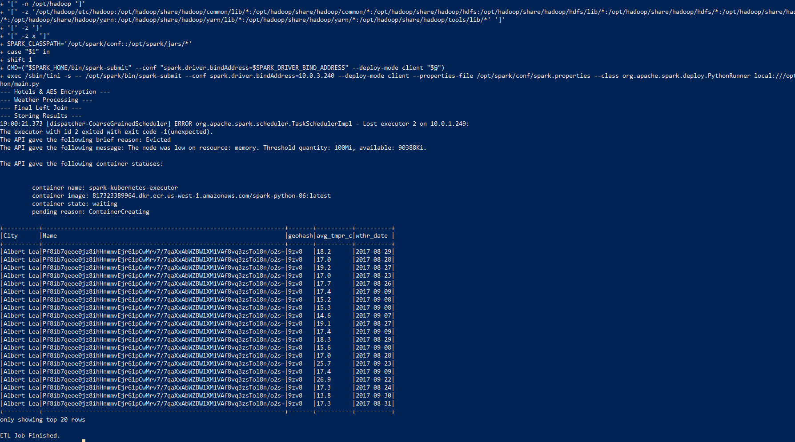
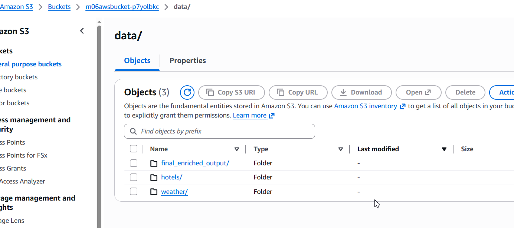
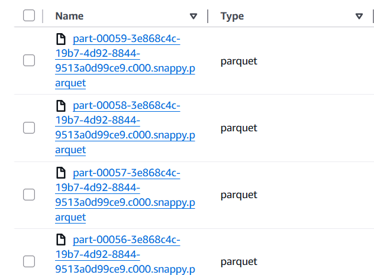
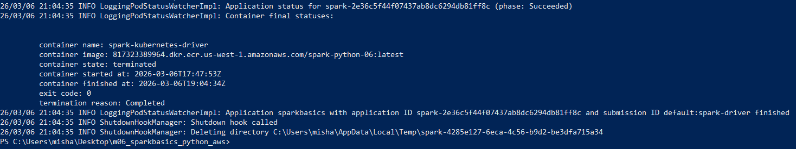
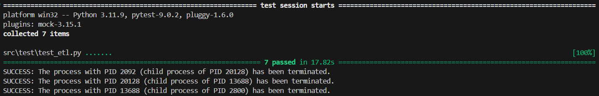

# Hotel & Weather Data Pipeline on AWS EKS

This project implements a scalable ETL pipeline using **Apache Spark** running on a **Kubernetes (EKS)** cluster. The pipeline enriches hotel data with weather information, handles PII encryption, and optimizes resource usage for memory-constrained environments.

## Tech Stack
* **Engine:** Apache Spark (PySpark)
* **Infrastructure:** AWS EKS (Elastic Kubernetes Service), Terraform
* **Storage:** AWS S3 (Parquet format)
* **Security:** AES-256 Encryption for PII data
* **Testing:** Pytest (7 unit & integration tests)
* **Orchestration:** Kubernetes (kubectl), Docker

---

## Key Features & Implementation Details

### 1. Infrastructure as Code (Terraform)
The infrastructure was provisioned using **Terraform**. To handle intensive Spark joins, the EKS cluster was dynamically scaled across multiple managed node groups to provide sufficient memory overhead.

### 2. PII Data Encryption
Security is implemented via **AES-256** encryption. Sensitive fields such as `Hotel Name` and `Address` are encrypted before storage to ensure data privacy.
* **Verification:** The final output confirms successful encryption, showing non-readable ciphertexts in the sensitive columns.

### 3. Spark Optimization in Kubernetes
Running Spark on `t3.small` instances (2GB RAM) required significant tuning to prevent **Out-of-Memory (OOM)** errors:
* **Memory Management:** Resolved `Evicted` status (available memory < 100Mi) by adjusting Spark memory fractions and implementing `repartition(100)` to reduce memory pressure during S3 write operations.
* **Resource Tuning:** Monitored real-time node resource availability to stabilize execution.

### 4. Automated Testing
A suite of unit tests was implemented to ensure the reliability of transformations.
* **Coverage:** 7 tests passed successfully, covering data enrichment, encryption, and geohash generation logic.

---

## Execution Evidence

| Stage | Resource | Description |
| :--- | :--- | :--- |
| **Data Integrity** |  | Final enriched table with successful Left Join and AES encryption. |
| **S3 Storage** |  | Partitioned data structure in the S3 bucket (`final_enriched_output`). |
| **Output Files** |  | Verification of Snappy-compressed Parquet files in S3. |
| **Job Completion** |  | Spark driver log confirming `phase: Succeeded` and `exit code: 0`. |
| **Logic Testing** |  | Successful execution of the automated test suite. |

---

## Project Structure & Maintenance
The project follows standard Git practices, including a strictly configured `.gitignore` to prevent bulky binaries (like `venv` or `.terraform` providers) from bloating the repository.

---

## Conclusion
This project demonstrates proficiency in cloud-native data engineering, focusing on infrastructure management, data security, and distributed systems optimization under strict resource constraints.